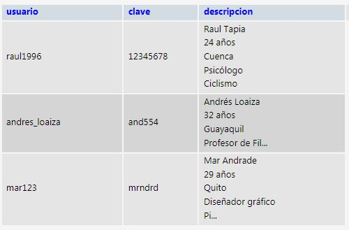

Deber Realziado con Java Swing y Base de Datos - POO 2023-B Caero

Esto es un programa realizado en Java con un Loginque permite verificar si un usuario se encuentra en la base de datos para acceder.
Aquí hay una vista de como se realizó la base de datos, hay una tabla con tres columnas, una para el usuario, otra para su respectiva clave y un campo de texto con una descripción de cada uno.
   
