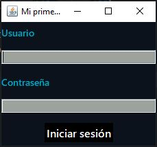
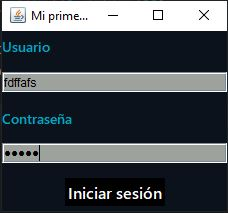
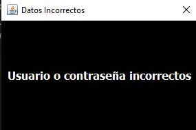
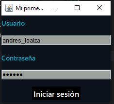

# Deber Realizado con Java Swing y Base de Datos - POO 2023-B Caero

* Esto es un programa realizado en Java con un Loginque permite verificar si un usuario se encuentra en la base de datos para acceder.
Aquí hay una vista de como se realizó la base de datos, hay una tabla con tres columnas, una para el usuario, otra para su respectiva clave y un campo de texto con una descripción de cada uno.

   
   
* A continuación: procedí a ejecutar el programa, apenas corremos el código esta pantalla es lo que veremos: un login, se nos preguntará el usuario y su contraseña.
   
   

* Para ver el funcionamiento del programa, tendré que ingresar datos, aquí se refleja como se ven el usuario se verá claramente en el texto, la contraseña al ser un PasswordField  nos mostrará solo puntos por cada caracter. En este caso, ingresamos cualquier texto en estos campos.

   

* Lo siguiente será el resultado de ingresar esos datos que no existen, con un JDialog se nos mostarará lo siguiente.

   

* Se procede a ingresar unas credenciales que sí estén en el sistema, como se ve aquí.

   

* De acuerdo al usuario, que se haya identificado se verá en la siguiente pantalla, se abrirá un nuevo JFrame con la información de aquella persona y se cerrará la pantalla para iniciar sesión.

   
